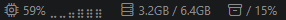

# Moba Status Bar

CPU, memory, and disk usage monitor with a compact trend graph in the VS Code status bar.

Keep system resource usage visible at all times without leaving your editor. Moba Status Bar shows live CPU, memory, and disk usage directly in the status bar, with a built-in trend graph and one-click access to top resource-consuming processes.

[View on Visual Studio Marketplace](https://marketplace.visualstudio.com/items?itemName=tangkeimg.moba-status-bar)

## Preview



## Why Moba Status Bar?

- **Live CPU usage with trend graph** directly in the status bar
- **Memory usage at a glance**
- **Disk usage for current workspace**
- **One-click process inspection** (CPU & memory)
- **Automatic warning highlights** when usage is high
- **Lightweight and configurable**

## Quick Start

Install the extension and CPU, memory, and disk usage will appear automatically in the status bar.

No setup required. Customize behavior later in Settings if needed.

## Features

- **CPU usage with trend graph**: shows real-time CPU usage with a compact trend graph in the status bar.
- **Memory usage in the status bar**: shows used memory and total memory, for example `8.4GB / 16.0GB`.
- **Workspace disk usage**: shows usage for the disk that contains your first workspace folder. If no workspace is open, it uses your home directory.
- **Top CPU processes**: click the CPU item or run the command to see the top 5 CPU-consuming processes.
- **Top memory processes**: click the memory item or run the command to see the top 5 memory-consuming processes.
- **Warning highlights**: CPU, memory, and disk items can highlight automatically when usage reaches your configured threshold.
- **Configurable refresh rate**: choose how often CPU and memory usage updates.

## Status Bar Items

After installation, the extension starts automatically when VS Code finishes launching.

| Item | What it shows | Action |
| --- | --- | --- |
| `$(chip)` CPU | Current CPU usage trend and percentage | Click to show top CPU processes |
| `$(server)` Memory | Used memory / total memory | Click to show top memory processes |
| `$(archive)` Disk | Workspace disk label and usage percentage | Hover to view target path and usage |

## Commands

Open the Command Palette with `Ctrl+Shift+P` / `Cmd+Shift+P` and run:

| Command | Description |
| --- | --- |
| `Moba Status Bar: Show Top CPU Processes` | Shows the top 5 CPU-consuming processes. |
| `Moba Status Bar: Show Top Memory Processes` | Shows the top 5 memory-consuming processes. |

## Settings

You can configure Moba Status Bar from VS Code settings.

| Setting | Default | Description |
| --- | --- | --- |
| `mobaStatusBar.cpuEnabled` | `true` | Enable CPU monitoring. When disabled, CPU sampling and CPU trend history are not collected. |
| `mobaStatusBar.cpuWarningThresholdPercent` | `90` | Highlight the CPU item when CPU usage is at or above this percentage. |
| `mobaStatusBar.showCpuTrendGraph` | `true` | Show a compact CPU usage trend graph in the status bar. |
| `mobaStatusBar.cpuTrendGraphLength` | `6` | Number of samples shown in the CPU trend graph. |
| `mobaStatusBar.memoryEnabled` | `true` | Enable memory monitoring. When disabled, memory usage is not sampled. |
| `mobaStatusBar.memoryWarningThresholdPercent` | `90` | Highlight the memory item when memory usage is at or above this percentage. |
| `mobaStatusBar.diskEnabled` | `true` | Enable disk monitoring. When disabled, disk usage is not sampled. |
| `mobaStatusBar.diskWarningThresholdPercent` | `85` | Highlight the disk item when disk usage is at or above this percentage. |
| `mobaStatusBar.refreshIntervalMs` | `1000` | Enabled monitor refresh interval in milliseconds. Values below `500` are clamped to `500`. |
| `mobaStatusBar.alignment` | `right` | Place the status bar items on the `left` or `right` side of the VS Code status bar. |
| `mobaStatusBar.enabled` | `true` | Enable or disable the status bar monitor. |

Example `settings.json`:

```json
{
  "mobaStatusBar.cpuEnabled": true,
  "mobaStatusBar.cpuWarningThresholdPercent": 85,
  "mobaStatusBar.showCpuTrendGraph": true,
  "mobaStatusBar.cpuTrendGraphLength": 6,
  "mobaStatusBar.memoryEnabled": true,
  "mobaStatusBar.memoryWarningThresholdPercent": 90,
  "mobaStatusBar.diskEnabled": true,
  "mobaStatusBar.diskWarningThresholdPercent": 80,
  "mobaStatusBar.refreshIntervalMs": 1500,
  "mobaStatusBar.alignment": "right",
  "mobaStatusBar.enabled": true
}
```

## Notes

- Disk usage is cached and refreshed less often than CPU and memory to keep the extension lightweight.
- Disabled monitors are not sampled in the refresh loop.
- Process lists are collected only when you open them.
- On Windows, process data is collected through PowerShell/CIM. On macOS and Linux, it is collected through `ps`.

## License

[MIT](LICENSE)
